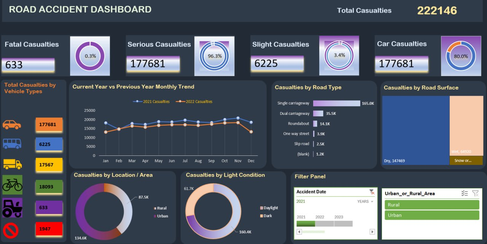

# Road-Accident-Dashboards

## Demo

*Click the image above to watch the full demo on YouTube*

## Dashboard Preview

## Project Overview

This project analyzes road accident data using **Microsoft Excel** to identify trends, patterns, and key insights related to traffic accidents. Raw data is transformed into an interactive dashboard with pivot tables, charts, and visualizations for data-driven decision-making.

## Features

- Data cleaning and preprocessing in Excel
- Interactive dashboard with charts and graphs
- Analysis of accident severity, location, and time
- Trend analysis to identify accident patterns
- Easy-to-understand visual reports

## Tools Used

| Tool | Purpose |
|------|---------|
| Microsoft Excel | Data processing & visualization |
| Pivot Tables | Data aggregation & summarization |
| Charts & Graphs | Visual representation of insights |
| Slicers & Timelines | Interactive filtering |

## Dataset

The dataset is sourced from **Kaggle** and contains historical road accident records. It includes fields such as accident severity, location, vehicle type, weather conditions, and time of day.

## Objective

The main goal of this project is to transform raw road accident data into meaningful insights that can help understand accident trends and support data-driven decision-making for road safety improvements.

## How to Use

1. Download the `Road Accident Data.xlsx` file
2. Open in Microsoft Excel (2016 or later recommended)
3. Navigate to the dashboard sheet
4. Use slicers and filters to explore the data interactively
